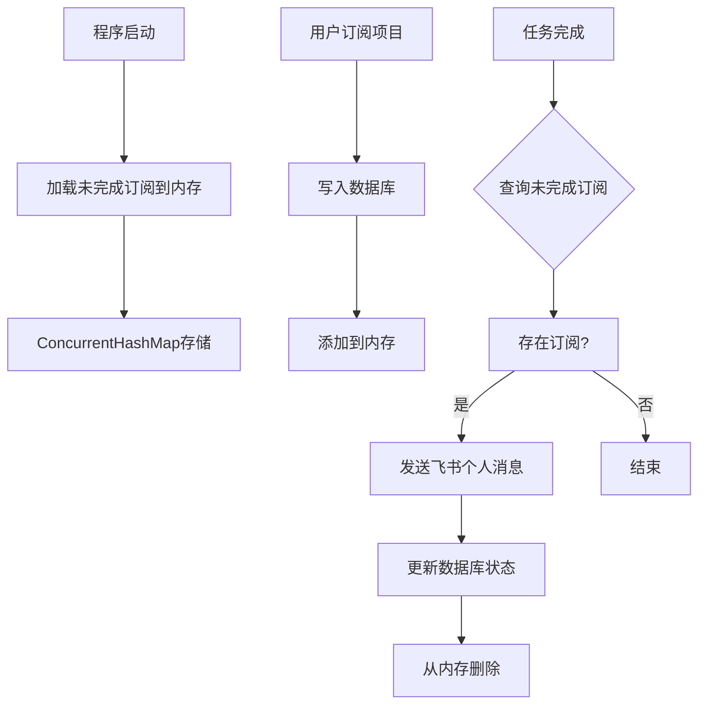

# 项目订阅系统数据库改造设计文档

## 1. 数据库表结构设计

### 1.1 项目订阅表 (project_subscription)

```sql
CREATE TABLE group_center.project_subscription (
    id BIGINT AUTO_INCREMENT PRIMARY KEY,
    project_id VARCHAR(255) NOT NULL COMMENT '项目ID',
    user_name_eng VARCHAR(255) NOT NULL COMMENT '用户英文名',
    user_name VARCHAR(255) NOT NULL COMMENT '用户中文名',
    status VARCHAR(20) NOT NULL DEFAULT 'pending' COMMENT '状态: pending, completed',
    created_time TIMESTAMP DEFAULT CURRENT_TIMESTAMP,
    completed_time TIMESTAMP NULL,
    task_id VARCHAR(255) DEFAULT NULL COMMENT '关联的任务ID',
    
    -- 索引优化
    INDEX idx_project_id_status (project_id, status),
    INDEX idx_user_name_eng (user_name_eng),
    INDEX idx_status (status),
    INDEX idx_created_time (created_time),
    INDEX idx_task_id (task_id)
) ENGINE=InnoDB DEFAULT CHARSET=utf8mb4 COMMENT='项目订阅表';
```

## 2. 系统架构设计

### 2.1 整体架构



### 2.2 核心组件

1. **ProjectSubscriptionModel**: 数据库模型类
2. **ProjectSubscriptionMapper**: MyBatis Plus Mapper接口
3. **ProjectSubscriptionService**: 业务逻辑服务
4. **GpuTaskController**: 任务完成监听

## 3. 关键业务流程

### 3.1 任务完成触发订阅通知

在 `GpuTaskController.postGpuTaskInfo()` 中，当检测到 `messageType == "finish"` 时：

1. 查询数据库中该项目的未完成订阅
2. 为每个订阅用户发送飞书个人消息
3. 更新订阅状态为完成
4. 从内存中删除已完成订阅

### 3.2 程序启动时加载未完成订阅

使用 `@PostConstruct` 注解的方法：

1. 查询数据库中所有 `status = 'pending'` 的订阅
2. 加载到内存的 `ConcurrentHashMap` 中
3. 按项目ID分组存储，便于快速查询

## 4. 技术实现细节

### 4.1 内存管理策略

```kotlin
// 内存结构：项目ID -> 用户英文名集合
private val pendingSubscriptions = ConcurrentHashMap<String, MutableSet<String>>()

// 反向索引：用户英文名 -> 项目ID集合
private val userSubscriptions = ConcurrentHashMap<String, MutableSet<String>>()
```

### 4.2 数据库操作优化

- 使用 MyBatis Plus 的 `QueryWrapper` 进行条件查询
- 使用 `@Transactional` 确保数据库操作的原子性
- 批量更新已完成订阅，减少数据库访问次数

### 4.3 飞书个人消息发送

集成现有的 `LarkBot` 类，需要用户ID映射：
- 通过用户英文名查找对应的飞书用户ID
- 使用 `LarkBot(userId).sendText(message)` 发送消息

## 5. 性能优化

### 5.1 索引优化

- 复合索引 `(project_id, status)`：加速项目状态查询
- 单列索引 `user_name_eng`：加速用户查询
- 时间索引 `created_time`：支持时间范围查询

### 5.2 内存优化

- 只保留未完成订阅，减少内存占用
- 使用 `ConcurrentHashMap` 确保线程安全
- 定期清理过期订阅（可扩展）

## 6. 错误处理

### 6.1 数据库操作异常

- 使用 try-catch 捕获数据库异常
- 记录详细错误日志
- 提供友好的错误提示

### 6.2 消息发送失败

- 记录发送失败的用户和项目
- 可选择重试机制（可扩展）
- 不影响主业务流程

## 7. 数据库初始化SQL脚本

```sql
-- 项目订阅表
CREATE TABLE IF NOT EXISTS group_center.project_subscription (
    id BIGINT AUTO_INCREMENT PRIMARY KEY,
    project_id VARCHAR(255) NOT NULL COMMENT '项目ID',
    user_name_eng VARCHAR(255) NOT NULL COMMENT '用户英文名',
    user_name VARCHAR(255) NOT NULL COMMENT '用户中文名',
    status VARCHAR(20) NOT NULL DEFAULT 'pending' COMMENT '状态: pending, completed',
    created_time TIMESTAMP DEFAULT CURRENT_TIMESTAMP,
    completed_time TIMESTAMP NULL,
    task_id VARCHAR(255) DEFAULT NULL COMMENT '关联的任务ID',
    
    -- 索引优化
    INDEX idx_project_id_status (project_id, status),
    INDEX idx_user_name_eng (user_name_eng),
    INDEX idx_status (status),
    INDEX idx_created_time (created_time),
    INDEX idx_task_id (task_id)
) ENGINE=InnoDB DEFAULT CHARSET=utf8mb4 COMMENT='项目订阅表';

-- 添加表结构到现有数据库初始化脚本
-- 请将上述SQL添加到 src/main/resources/db/mysql/init-schema.sql 文件中
```

## 8. 扩展性考虑

### 8.1 订阅类型扩展

- 支持多种订阅类型（项目、用户、设备等）
- 支持自定义通知条件